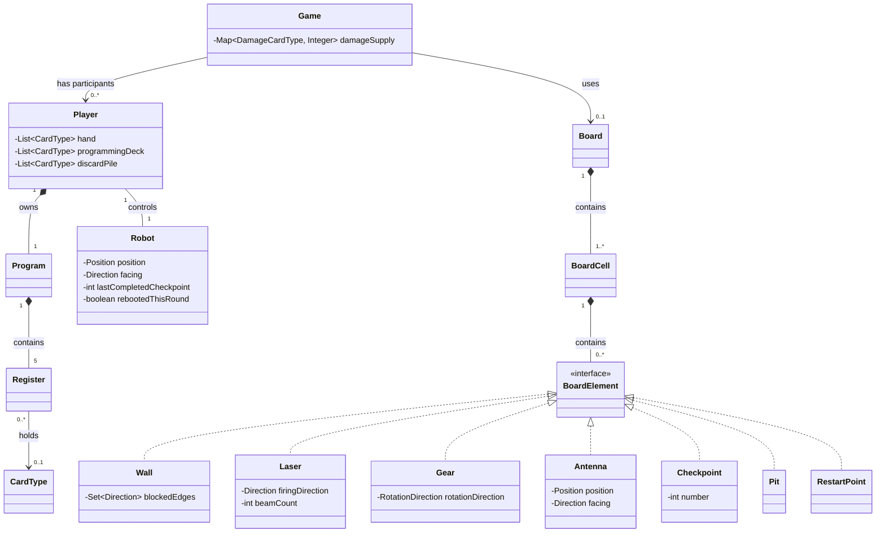

# Domain model diagram

```mermaid
classDiagram
    Program "1" *-- "5" Register : contains
    Player "1" -- "1" Robot : controls
    Board "1" *-- "1..*" BoardCell : contains
    BoardCell "1" *-- "0..*" BoardElement : contains
    class BoardElement {
        <<interface>>
    }
    BoardElement <|.. Wall
    BoardElement <|.. Laser
    BoardElement <|.. Gear

    Register "0..*" --> "0..1" CardType : holds
    Game --> "0..*" Player : has participants
    Player "1" *-- "1" Program : owns
    Player : -List~CardType~ hand
    Player : -List~CardType~ programmingDeck
    Player : -List~CardType~ discardPile

    Game --> "0..1" Board : uses
    Robot : -Position position
    Robot : -Direction facing

    Wall : -Set~Direction~ blockedEdges

    Laser : -Direction firingDirection
    Laser : -int beamCount

    Gear : -RotationDirection rotationDirection
    BoardElement <|.. Antenna
    Antenna : -Position position
    Antenna : -Direction facing

    BoardElement <|.. Checkpoint
    BoardElement <|.. Pit
    BoardElement <|.. RestartPoint
    Checkpoint : -int number
    Robot : -int lastCompletedCheckpoint
    Robot : -boolean rebootedThisRound

    Game : -Map~DamageCardType, Integer~ damageSupply
```

